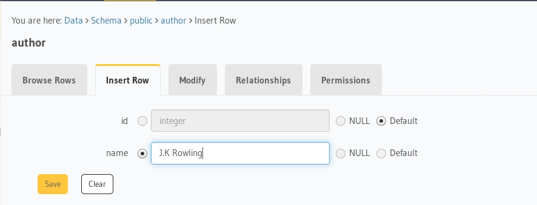

# svelte-apollo-app

A sample [Svelte 3](https://svelte.dev) app to demonstrate usage of GraphQL Queries, Mutations and Subscriptions with [svelte-apollo](https://github.com/timhall/svelte-apollo), Hasura GraphQL engine and Postgres as database. Forked from the standard svelte [template](https://github.com/sveltejs/template)

## Deploy Hasura

- Deploy Postgres and GraphQL Engine on Azure using Container Instances:
  
  [](https://portal.azure.com/#create/Microsoft.Template/uri/https%3a%2f%2fraw.githubusercontent.com%2fhasura%2fgraphql-engine%2fmaster%2finstall-manifests%2fazure-container-with-pg%2fazuredeploy.json)

  Please checkout the [docs](https://docs.hasura.io/1.0/graphql/manual/deployment/index.html) for other deployment methods

- Get the Container Instance URL (say `my-app.westus.azurecontainer.io`)
- Create `author` table:
  
  Open Hasura console: visit http://my-app.westus.azurecontainer.io/console on a browser  
  Navigate to `Data` section in the top nav bar and create a table as follows:

  

- Insert sample data into `author` table:

  

  Verify if the row is inserted successfully

  

- Similarly, create an article table with the following data model:
table: `article`
columns: `id`, `title`, `content`, `author_id` (foreign key to `author` table's `id`) and `created_at`

  

- Now create a relationship from article table to author table by going to the Relationships tab.

  

- Clone this repo:
  ```bash
  git clone https://github.com/beasync/svelte-apollo-app
  ```

## Setup App

Install the dependencies...

```bash
yarn
```

- Open `src/apollo.js` and configure Hasura's GraphQL Endpoint as follows: 

```javascript

  const wsLink = new WebSocketLink({
    uri: "ws://localhost:8080/v1/graphql",
    options: {
      reconnect: true,
      lazy: true
    },
    connectionParams: () => {
      return { headers: getHeaders() };
    },
  });

  const httpLink = new HttpLink({
    uri: "http://localhost:8080/v1/graphql",
    headers: getHeaders()
  });

```
Replace the `uri` argument with your Hasura GraphQL Endpoint for both `wsLink` and `httpLink`

Start [Rollup](https://rollupjs.org):

```bash
yarn dev
```

Navigate to [localhost:5000](http://localhost:5000). You should see your app running. Edit a component file in `src`, save it, and reload the page to see your changes.

## Deploying to the cloud

### With Azure

Deploy to Azure using the static website hosting in Azure Storage. See the [docs](https://docs.microsoft.com/bs-latn-ba/azure/storage/blobs/storage-blob-static-website).

